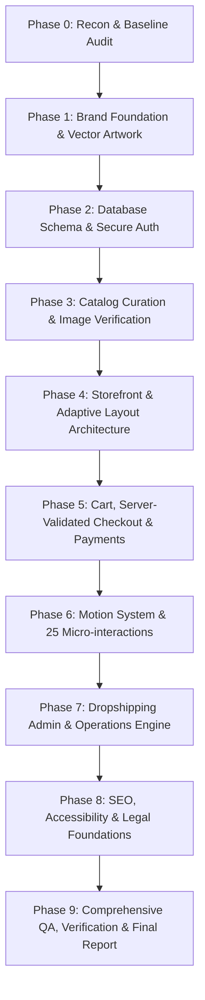

# ZenPaaw Store: Master Execution & Engineering Plan

This document outlines the phased engineering plan to rebuild the ZenPaaw pet-toy marketplace from the audited baseline into an enterprise-grade, dropshipping-ready application meeting all criteria in `ZENPAAW_MASTER_PROMPT.md`.

---

## Phase Roadmap Overview

---

## Phase Details

### Phase 0: Recon, Quality Gates & Baseline Proof
- **Objectives:**
  1. Read bundled Next.js 16.4.0 docs, Turbopack configs, and motion library specifications.
  2. Implement quality gate scripts in `scripts/`: `audit-copy.ts`, `audit-claims.ts`, `audit-security.ts`, `audit-images.ts`, and `launch-check.ts`.
  3. Execute audits against baseline repo to confirm findings C1–C9, K1–K4, B1–B3, P1–P4, M1–M5.
  4. Initialize Git repository with baseline commit.
- **Verification:**
  - Audits run and conclusively catch all 25 baseline defects.
  - Plan artifact created.

### Phase 1: Brand Foundation & Real Vector Artwork
- **Objectives:**
  1. Inspect supplied artwork files in `Logo Assets/` (`ZenPaaw Logo colored.png`, `ZenPaaw Logo Icon.png`, `ZenPaaw Logo horizontal.png`, `ZenPaaw Logo vertical.png`).
  2. Extract SVG vector assets with sub-1% pixel difference:
     - `public/brand/zenpaaw-symbol.svg` (solid yellow `#FFC800` paw print with transparent Z cut-out)
     - `public/brand/zenpaaw-wordmark-white.svg` and `zenpaaw-wordmark-teal.svg` (single-colour wordmark with TM)
     - `public/brand/zenpaaw-lockup-stacked.svg` (symbol + wordmark + tagline with comma: "Happy Pets, Happier Lives.")
     - `public/brand/zenpaaw-horizontal.svg`
  3. Generate icons: `app/icon.svg`, `favicon.ico`, `apple-icon.png`, `icon-192.png`, `icon-512.png`, `manifest.webmanifest`, and 1200x630 `opengraph-image`.
  4. Replace `src/components/ZenPaawLogo.tsx` with dynamic multi-variant SVG component supporting interactive toe animations.
  5. Configure typography (`Outfit` and `Plus Jakarta Sans` via `next/font`) and design tokens in `src/app/globals.css`.
- **Verification:**
  - Visual inspection & diff test verifying < 1% difference against PNG artwork.
  - `npm run typecheck`, `npm run lint`, `npm run build`.

### Phase 2: Data Layer & Hardened Security Architecture
- **Objectives:**
  1. Build Drizzle ORM schema (`src/lib/db/schema.ts`) covering all 14 entities: `products`, `variants`, `product_images`, `claims`, `categories`, `collections`, `suppliers`, `orders`, `order_items`, `shipments`, `coupons`, `reviews`, `wishlists`, `audit_log`, `price_history`.
  2. Implement robust database client with migration runner.
  3. Completely remove `src/lib/db.ts` module-level array store and all fake seeded orders/reviews.
  4. Secure admin authentication: password hashing, signed `httpOnly` `Secure` `SameSite=Lax` JWT sessions via `jose`, rate limiting, and session verification helpers.
  5. Harden all API routes: 401 unauthorized checks on admin endpoints and public order data; input validation with `zod`; environment validation in `src/env.ts`.
- **Verification:**
  - `audit:security` passes.
  - Server routes return 401 when unauthorized.

### Phase 3: Real Catalog & Verified Imagery
- **Objectives:**
  1. Construct `data/catalog.seed.json` with 60+ real unbranded pet toys across Dogs, Puppies, and Cats.
  2. Ensure every category meets minimum counts (Chew, Fetch, Tug, Plush, Puzzle, Water, Teething, Cat wands, Kickers, Tracks, etc.).
  3. Ensure at least 40% have multi-variant options.
  4. Curate distinct high-resolution images for each product (at least 4 per product: clean cut-out, in-use, detail, scale/angle). Zero shared images across products.
  5. Delete legacy banned images from product use (`toy-isolated.jpg`, `hero-dog.jpg`, `packaging-box.jpg`, `packaging-concepts.png`).
  6. Generate `docs/IMAGE_LOG.csv` logging sources and licenses.
- **Verification:**
  - `audit:images` passes with zero duplicate pHash collisions and 0 banned files.

### Phase 4: Storefront & Adaptive Layout System
- **Objectives:**
  1. Server Components architecture for data fetching (Home, Shop, Category, Collection, Product).
  2. Header with mega-menu, search modal, wishlist, and cart drawer.
  3. Product Card with hover image swap, wishlist toggle, and quick add.
  4. Faceted filters with URL sync, desktop sticky sidebar, and mobile bottom sheet.
  5. Interactive Find-a-Toy 3-step recommendation guide.
  6. Fluid responsive layout adapting across 360px, 390px, 768px, 1024px, 1440px, and 1920px viewports without horizontal scroll.
- **Verification:**
  - Viewport testing confirms zero layout shifts and clean breakpoints.

### Phase 5: Cart, Checkout, Payments & Order Flow
- **Objectives:**
  1. Cart state holding `{variantId, qty}`, re-validated against database on load.
  2. Server-side price recalculation: variant price, coupons, shipping, and tax.
  3. Provider-agnostic payment architecture (`Stripe` & `Paystack` adapters) with hosted/embedded flows and webhook signature verification.
  4. Sequential order generation (`ZP-100001`+).
  5. Order confirmation (`/order/[number]`) and order tracking (`/track`) requiring email or signature verification.
  6. Branded email notification templates.
- **Verification:**
  - Unit tests prove client-sent prices cannot tamper with checkout totals.
  - Full simulated test purchase from cart to confirmation.

### Phase 6: Motion & Micro-interaction System
- **Objectives:**
  1. `<RevealText>` and `<RevealBlock>` heading animations with `IntersectionObserver` across all pages.
  2. Smooth page transitions (`app/template.tsx`) and navigation progress bar.
  3. Implement all 25 micro-interactions (fly-to-cart, rolling badge counter, magnetic buttons, swatches, accordions, toast notifications, free shipping progress bar, etc.).
  4. `prefers-reduced-motion` compliance.
- **Verification:**
  - Motion operates at 60fps; accessible fallback in place.

### Phase 7: Dropshipping Admin & Fulfillment Operations
- **Objectives:**
  1. Protected `/admin` dashboard with metrics (Revenue, Orders, AOV, Gross Margin, low-margin alerts).
  2. Order management pipeline (`paid` -> `sent_to_supplier` -> `shipped` -> `delivered`).
  3. Supplier fulfillment panel: supplier SKU, supplier cost, "Copy supplier details", tracking number injection.
  4. Product catalog management: variant matrix, verified claims toggle, pricing margin floor enforcement.
  5. Bulk CSV import/export.
- **Verification:**
  - Admin login, order status updates, and tracking numbers work smoothly.

### Phase 8: SEO, Accessibility, Legal & Compliance
- **Objectives:**
  1. Dynamic sitemap, `robots.ts`, Open Graph images, JSON-LD schemas (`Organization`, `Product`, `FAQPage`, `BreadcrumbList`).
  2. Legal pages: Privacy, Terms, Shipping, Returns generated from `store.config.ts`.
  3. Honest copy rewrite: zero banned words, zero emojis, zero fabricated claims.
  4. Accessibility: WCAG AA compliance, ARIA live regions, keyboard navigation.
- **Verification:**
  - `audit:copy` and `launch:check` pass.

### Phase 9: Quality Assurance & Final Acceptance Audit
- **Objectives:**
  1. Run all test suites: `npm run typecheck`, `npm run lint`, `npm run test`, `audit:copy`, `audit:claims`, `audit:security`, `audit:images`, `launch:check`.
  2. Compile `docs/AUDIT_REPORT.md` documenting all 25 audit items and proof of resolution.
  3. Document operations in `docs/SETUP.md`.
- **Verification:**
  - 100% of acceptance criteria in Section 17 verified.
